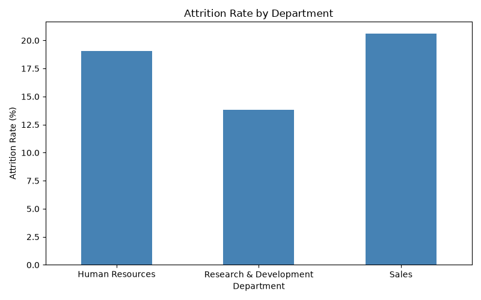
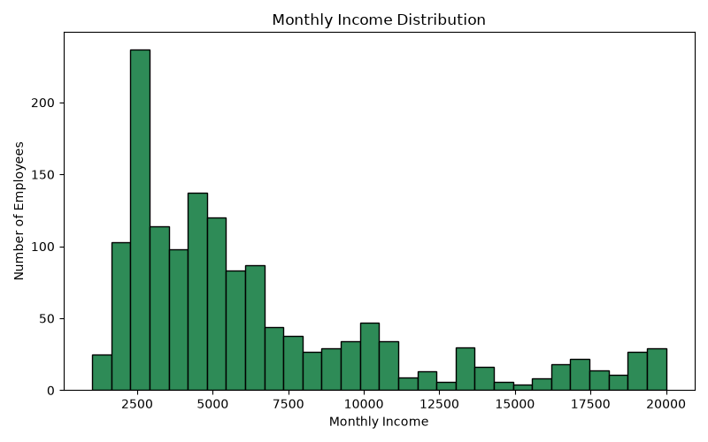

# HR Attrition Analysis (Python)

Analyzed a 1,470-employee HR dataset using Pandas, NumPy, and Matplotlib to identify 
patterns behind employee attrition.

## Charts

## Techniques Used
- Pandas: groupby aggregation with custom lambda functions, correlation analysis
- NumPy: statistical calculations (mean, median, standard deviation), outlier detection
- Matplotlib: bar chart and histogram visualizations

## Key Findings
- Average monthly income: 6,502.93 (Median: 4,919.00, Std Dev: 4,706.36)
- 128 employees identified as salary outliers (2+ standard deviations from the mean)
- Highest attrition department: **Sales** at 20.63%, followed by HR at 19.05% and R&D at 13.84%
- Highest-paid job role: **Manager** at 17,181.68 average monthly income, followed by Research Director at 16,033.55
- Correlation between job satisfaction and attrition: **-0.103** — a weak negative correlation, suggesting lower satisfaction is mildly associated with higher attrition, though not a strong standalone predictor

## Dataset
IBM HR Analytics Employee Attrition dataset (Kaggle, 1,470 rows, 35 columns)
